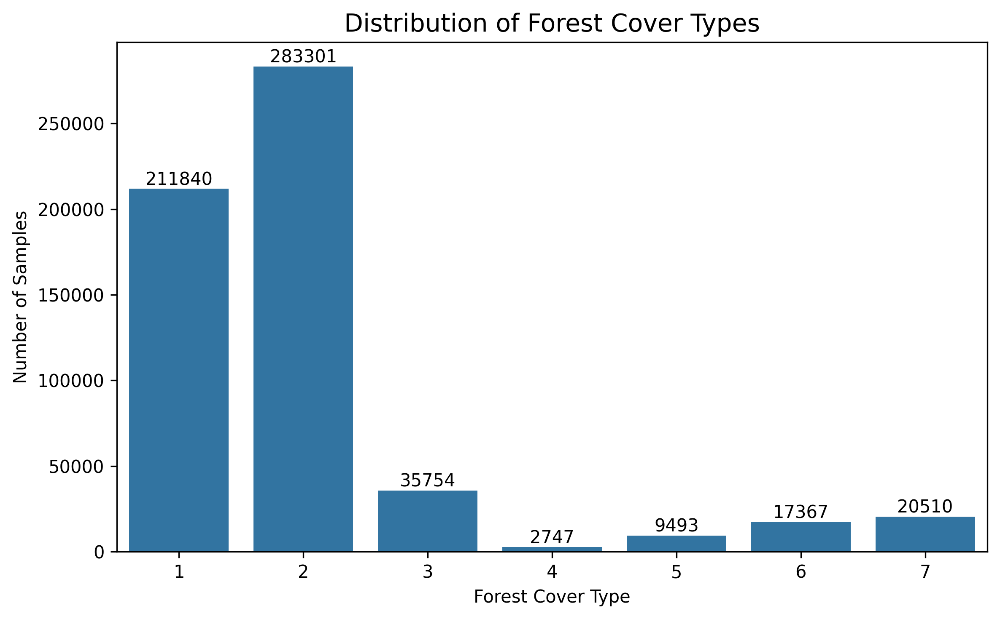
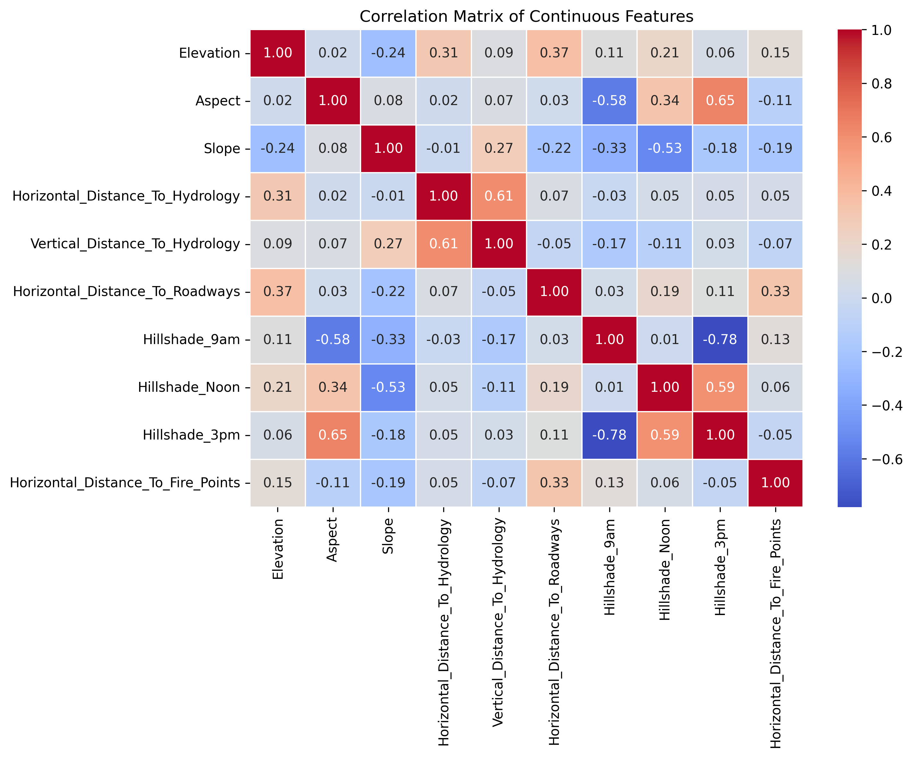
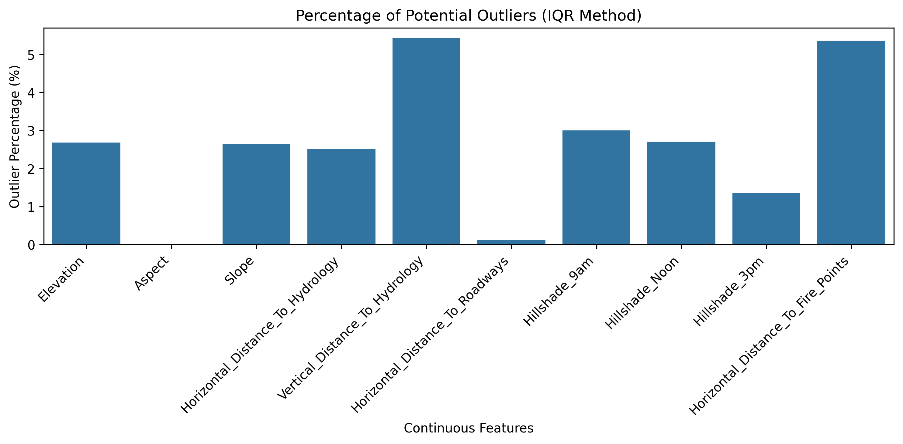
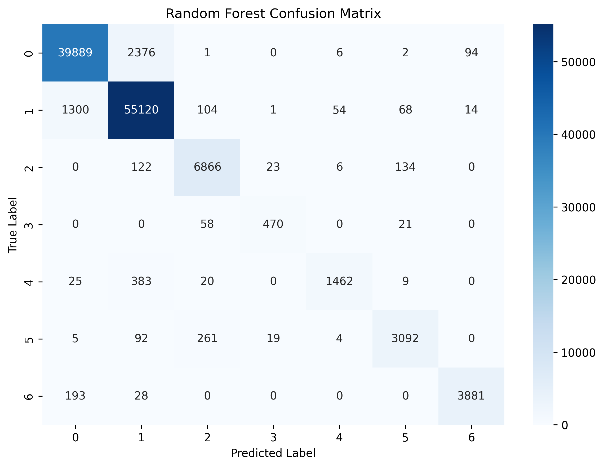
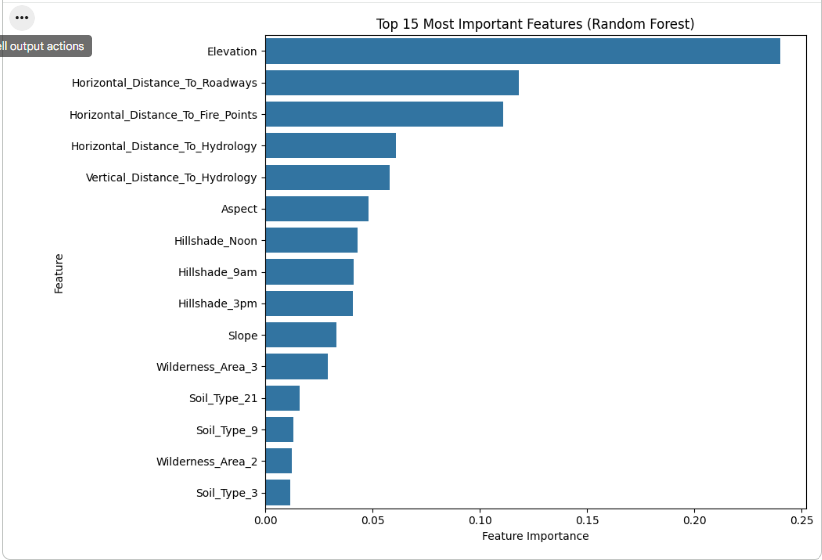
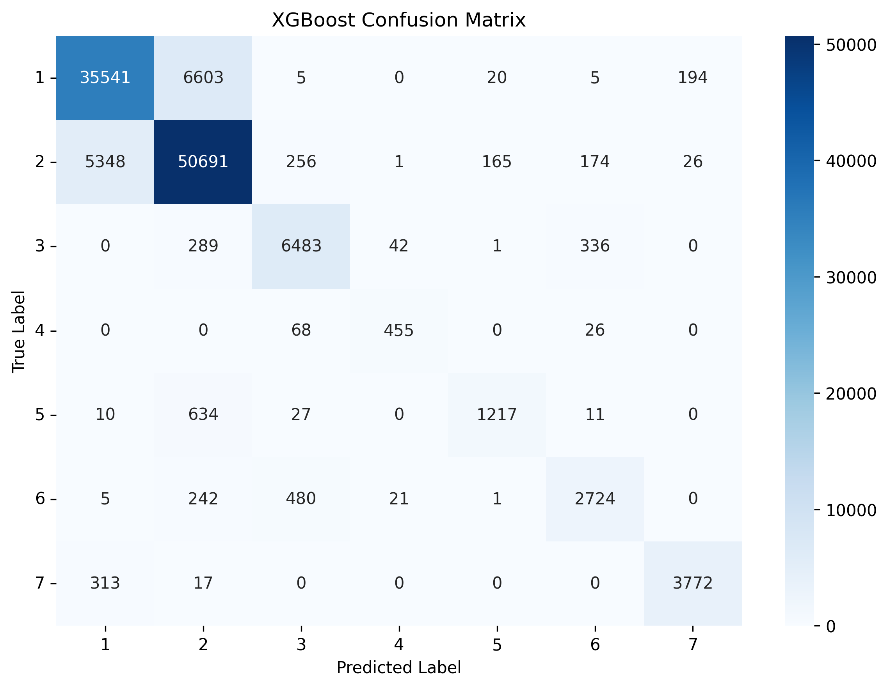
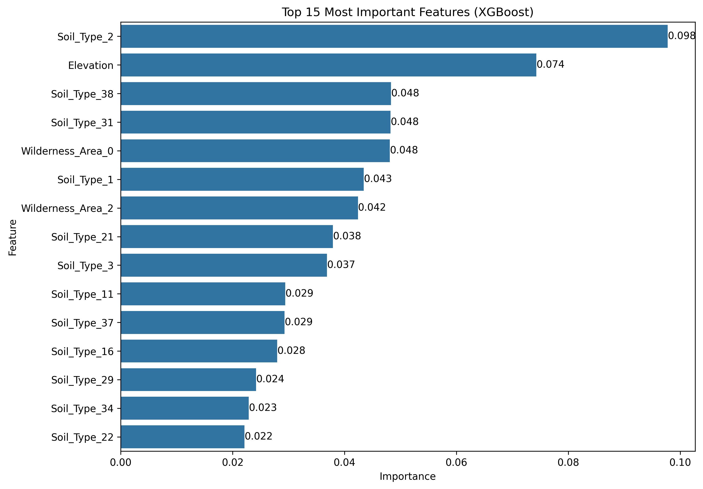
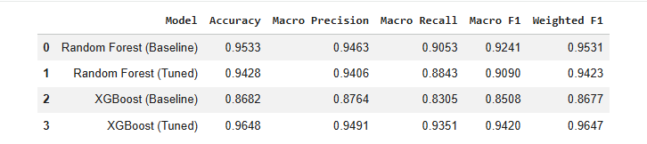

<div align="center">

# 🌲 Forest Cover Type Classification using Machine Learning

### End-to-End Multiclass Classification Pipeline with Random Forest & Tuned XGBoost

<p align="center">


</p>

### 📊 Final Model Performance

| Model | Accuracy | Macro F1 |
|:------|---------:|---------:|
| 🌳 Random Forest (Baseline) | **95.33%** | **0.9241** |
| 🌳 Random Forest (Tuned) | 94.28% | 0.9090 |
| 🚀 XGBoost (Baseline) | 86.82% | 0.8508 |
| 🏆 **XGBoost (Tuned)** | **96.48%** | **0.9420** |

**🏆 Final Selected Model:** Tuned XGBoost

---

</div>

# 📌 Project Overview

Forest cover type prediction is an important multiclass classification problem in environmental monitoring, forest resource management, ecological planning, and biodiversity conservation.

This project develops an **end-to-end machine learning pipeline** to classify forest cover types using cartographic and environmental measurements collected from the Roosevelt National Forest.

Rather than focusing only on predictive accuracy, this repository demonstrates a complete production-style machine learning workflow including:

- Data understanding
- Exploratory Data Analysis (EDA)
- Data preprocessing
- Baseline model development
- Hyperparameter optimization
- Feature importance analysis
- Model comparison
- Evidence-based model selection

The objective is to identify the most reliable classifier while maintaining a reproducible and interpretable machine learning pipeline.

---

# 🎯 Problem Statement

Given a set of cartographic and environmental attributes such as:

- Elevation
- Slope
- Aspect
- Hydrological distance
- Roadway distance
- Fire point distance
- Wilderness area
- Soil type

predict the correct **forest cover type** among seven possible categories.

This is a **multiclass supervised classification** problem where each observation belongs to exactly one forest cover class.

---

# 🎯 Project Objectives

The primary objectives of this project are:

- Build a complete multiclass classification pipeline
- Explore and understand the dataset through EDA
- Evaluate feature distributions and class imbalance
- Compare multiple tree-based machine learning algorithms
- Improve model performance through hyperparameter tuning
- Analyze feature importance
- Select the best-performing model using evidence-based evaluation

---

# 🌍 Real-World Applications

Forest cover classification has numerous practical applications, including:

- 🌲 Forest Resource Management
- 🔥 Wildfire Risk Assessment
- 🌱 Environmental Monitoring
- 🌎 Ecological Research
- 🛰️ Remote Sensing
- 📍 Land Cover Mapping
- 🏞️ Biodiversity Conservation
- 🧭 Environmental Planning

---

# 📂 Dataset Information

| Property | Value |
|-----------|------|
| Dataset | UCI Covertype Dataset |
| Total Samples | **581,012** |
| Total Features | **54** |
| Target Classes | **7 Forest Cover Types** |
| Problem Type | Multiclass Classification |
| Missing Values | None |
| Duplicate Records | None |

The dataset consists of quantitative cartographic variables along with binary wilderness area and soil type indicators describing different forest regions.

---

# 📁 Repository Structure

```text
forest-cover-type-classification-ml/

│
├── notebook/
│     └── Forest_Cover_Type_Classification.ipynb
│
├── images/
│     ├── 01_target_distribution.png
│     ├── 02_feature_distribution.png
│     ├── 03_correlation_heatmap.png
│     ├── 04_outlier_analysis.png
│     ├── 05_random_forest_confusion_matrix.png
│     ├── 06_random_forest_feature_importance.png
│     ├── 07_xgboost_confusion_matrix.png
│     ├── 08_xgboost_feature_importance.png
│     ├── 09_model_comparison.png
│     └── 10_winner_table.png
│
├── README.md
├── requirements.txt
├── LICENSE
└── .gitignore
```

---

# ⚙️ Machine Learning Workflow

```text
                UCI Covertype Dataset
                         │
                         ▼
              Initial Data Inspection
                         │
                         ▼
                 Data Cleaning Check
                         │
                         ▼
          Exploratory Data Analysis (EDA)
                         │
                         ▼
               Data Preprocessing
                         │
                         ▼
                Train-Test Split
                         │
          ┌──────────────┴──────────────┐
          ▼                             ▼
 Random Forest                  XGBoost Baseline
   Baseline                            │
          │                            ▼
          │                  Hyperparameter Tuning
          │                            │
          └──────────────┬─────────────┘
                         ▼
               Model Performance Comparison
                         │
                         ▼
             Best Model Selection (XGBoost)
```

---

# 🛠️ Technology Stack

| Category | Tools |
|-----------|------|
| Programming Language | Python |
| Data Processing | Pandas, NumPy |
| Visualization | Matplotlib, Seaborn |
| Machine Learning | Scikit-learn |
| Gradient Boosting | XGBoost |
| Hyperparameter Optimization | RandomizedSearchCV |
| Development Environment | Jupyter Notebook |

---

# 📈 Exploratory Data Analysis (EDA)

A comprehensive exploratory analysis was performed before model development to understand feature distributions, identify class imbalance, inspect correlations, and detect potential outliers.

The analysis confirmed that the dataset is clean, contains no missing values or duplicate observations, and is well suited for tree-based machine learning algorithms.

The following sections present the most important findings from the exploratory analysis.

---

# 📊 Exploratory Data Analysis

Before training any machine learning model, a comprehensive exploratory analysis was conducted to better understand the dataset, identify potential issues, and guide subsequent modeling decisions.

The analysis focused on:

- Target class distribution
- Feature distributions
- Correlation among continuous variables
- Outlier inspection
- Feature importance before and after modeling

---

# 🎯 Target Class Distribution

<p align="center">

</p>

### Key Observations

- The dataset contains **seven forest cover classes**.
- The class distribution is moderately imbalanced.
- Majority classes contain substantially more observations than minority classes.
- Since the imbalance is not extreme, **SMOTE was intentionally not applied**.
- Macro evaluation metrics (Macro Precision, Recall, and F1-score) were used to ensure fair evaluation across all classes.

---

# 📈 Continuous Feature Distribution

<p align="center">

</p>

### Key Observations

The numerical variables exhibit diverse statistical characteristics.

Important findings include:

- Elevation spans a wide geographical range.
- Distance-based variables contain long-tailed distributions.
- Hillshade variables remain within physically meaningful ranges.
- Several variables are naturally skewed, which is expected for geographical measurements.

Since the selected models are tree-based ensemble algorithms, **feature scaling was not required**.

---

# 🔥 Correlation Analysis

<p align="center">

</p>

### Key Observations

The correlation matrix was analyzed using continuous variables only.

The analysis revealed:

- No evidence of severe multicollinearity.
- Distance-based variables exhibit moderate relationships.
- Elevation shows meaningful associations with several environmental measurements.
- Tree-based models are naturally robust to moderate feature correlation.

Therefore, **no feature removal was performed based on correlation alone.**

---

# 📦 Outlier Analysis

<p align="center">

</p>

### Key Observations

Potential outliers were identified using the Interquartile Range (IQR) method.

The analysis showed that:

- Several geographical variables contain statistically detectable outliers.
- These observations are likely to represent **valid environmental conditions rather than data entry errors**.
- Removing these values could eliminate important ecological information.

Consequently, **no outlier removal was performed.**

This decision preserves the real-world distribution of the dataset.

---

# 🧹 Data Quality Assessment

The dataset was inspected prior to modeling.

| Assessment | Result |
|------------|--------|
| Missing Values | ✅ None |
| Duplicate Records | ✅ None |
| Invalid Target Labels | ✅ None |
| Data Leakage | ✅ Not Observed |

Since no major data quality issues were detected, **no data cleaning operations were required beyond validation.**

---

# ⚙️ Data Preprocessing

The following preprocessing strategy was adopted:

- Binary categorical features were retained in their original form.
- Continuous variables were preserved without normalization.
- Target labels were encoded only for XGBoost.
- Stratified Train-Test Split was applied to preserve class proportions.
- Hyperparameter tuning was performed using RandomizedSearchCV.

This preprocessing pipeline minimizes unnecessary transformations while remaining fully compatible with tree-based ensemble methods.

---

# 🌳 Baseline Model — Random Forest

Random Forest was selected as the first baseline model because it:

- Handles nonlinear relationships effectively.
- Is naturally resistant to overfitting.
- Requires minimal preprocessing.
- Performs exceptionally well on structured tabular datasets.

### Random Forest Confusion Matrix

<p align="center">

</p>

The confusion matrix demonstrates strong classification performance across all forest cover classes with relatively few misclassifications.

---

### Random Forest Feature Importance

<p align="center">

</p>

### Key Findings

The Random Forest model identified several highly influential predictors.

Among them:

- Elevation
- Horizontal Distance to Roadways
- Horizontal Distance to Fire Points
- Horizontal Distance to Hydrology

These variables contribute most strongly to forest cover discrimination.

Their ecological relevance further validates the learned decision boundaries.

---

# 🚀 Baseline Model — XGBoost

Extreme Gradient Boosting (XGBoost) was selected as the second baseline model to compare boosting-based learning with bagging-based learning.

XGBoost provides:

- Gradient boosting
- Regularization
- Efficient tree optimization
- Strong predictive performance on structured datasets

### XGBoost Confusion Matrix

<p align="center">

</p>

Although the baseline model produced competitive results, several classes remained difficult to distinguish.

This motivated the use of hyperparameter optimization.

---

### XGBoost Feature Importance

<p align="center">

</p>

### Key Findings

Unlike Random Forest, XGBoost assigned greater importance to several soil type indicators while still recognizing Elevation as one of the dominant predictors.

This difference reflects the distinct optimization strategies employed by the two algorithms rather than contradictory feature relevance.

---

# 🎯 Hyperparameter Optimization

Both tree-based models were optimized using **RandomizedSearchCV**.

Randomized Search was selected because it provides an efficient balance between computational cost and predictive performance on large datasets.

The optimization process explored multiple combinations of:

- Number of trees
- Tree depth
- Learning rate
- Feature sampling
- Sample sampling
- Child weight

The tuned models were subsequently retrained using the complete training dataset before final evaluation.

---

# 📊 Final Model Performance

The performance of all trained models was evaluated using the same independent test dataset to ensure a fair comparison.

| Model | Accuracy | Macro Precision | Macro Recall | Macro F1 | Weighted F1 |
|:------|---------:|----------------:|-------------:|---------:|------------:|
| 🌳 Random Forest (Baseline) | **95.33%** | **94.63%** | 90.53% | 92.41% | 95.31% |
| 🌳 Random Forest (Tuned) | 94.28% | 92.96% | 89.24% | 90.90% | 94.26% |
| 🚀 XGBoost (Baseline) | 86.82% | 87.64% | 83.05% | 85.08% | 86.77% |
| 🏆 **XGBoost (Tuned)** | **96.48%** | **94.91%** | **93.51%** | **94.20%** | **96.47%** |

---

# 📈 Overall Model Comparison

<p align="center">

</p>

The comparison clearly demonstrates the effect of hyperparameter optimization.

While the baseline Random Forest established a very strong benchmark, tuning significantly improved the XGBoost classifier, allowing it to achieve the highest predictive performance across all evaluation metrics.

---

# 🏆 Model Selection

<p align="center">

</p>

After evaluating all four models, **Tuned XGBoost** was selected as the final model because it achieved:

- ✅ Highest Accuracy
- ✅ Highest Macro Precision
- ✅ Highest Macro Recall
- ✅ Highest Macro F1 Score
- ✅ Highest Weighted F1 Score

The model demonstrated the best overall balance between global accuracy and class-wise performance.

---

# 🔍 Discussion

Several important observations emerged throughout this project.

### Random Forest

The baseline Random Forest produced outstanding performance without requiring extensive parameter optimization.

Interestingly, hyperparameter tuning did **not** improve its predictive capability. This demonstrates that strong baseline models should always be established before investing computational resources in optimization.

---

### XGBoost

The baseline XGBoost model initially underperformed compared with Random Forest.

However, after hyperparameter optimization, its performance improved dramatically.

The tuned model surpassed every other evaluated model, illustrating the significant influence that carefully selected hyperparameters can have on gradient boosting algorithms.

---

### Feature Importance

Although Random Forest and XGBoost ranked features differently, both consistently identified **Elevation** as one of the most influential predictors.

This finding aligns with ecological expectations, as elevation strongly influences climate, vegetation, and soil conditions that determine forest cover types.

---

# 💡 Key Takeaways

Throughout this project, several practical machine learning lessons were reinforced:

- Establishing a strong baseline model is essential before optimization.
- Hyperparameter tuning does not always improve model performance.
- Evidence-based model selection is more reliable than relying on accuracy alone.
- Macro evaluation metrics provide a fair assessment for multiclass datasets with class imbalance.
- Tree-based ensemble methods remain highly effective for structured tabular data.

---

# 🚀 Future Improvements

Potential extensions of this work include:

- LightGBM implementation
- CatBoost implementation
- Bayesian Hyperparameter Optimization
- SHAP Explainability
- Feature Selection Techniques
- Ensemble Stacking
- Probability Calibration
- Distributed Training
- Model Deployment using FastAPI
- Interactive Dashboard using Streamlit

---

# ⚙️ Installation

Clone the repository:

```bash
git clone https://github.com/Delwar2004/forest-cover-type-classification-ml.git
```

Navigate to the project directory:

```bash
cd forest-cover-type-classification-ml
```

Install the required packages:

```bash
pip install -r requirements.txt
```

---

# ▶️ How to Run

Launch Jupyter Notebook:

```bash
jupyter notebook
```

Open:

```
notebook/Forest_Cover_Type_Classification.ipynb
```

Run all cells sequentially to reproduce the complete workflow.

---

# 📦 Requirements

Main libraries used:

- Python 3.11+
- NumPy
- Pandas
- Matplotlib
- Seaborn
- Scikit-learn
- XGBoost
- Jupyter Notebook

---

# 🔄 Reproducibility

To ensure reproducible results throughout the experiments:

- Fixed random seed was used.
- Stratified train-test splitting was applied.
- Identical preprocessing pipeline was used for all models.
- All models were evaluated using the same test dataset.

---

# 🙏 Acknowledgements

This project uses the **UCI Covertype Dataset**, a widely recognized benchmark for multiclass classification and environmental machine learning research.

Special thanks to the open-source Python ecosystem, including the developers of Scikit-learn, XGBoost, Pandas, NumPy, Matplotlib, and Seaborn.

---

# 👨‍💻 Author

## MD DELWAR HUSEN

Intern @ Elevvo

Undergraduate Student — Information & Communication Engineering (ICE)

Machine Learning • Deep Learning • Computer Vision • Natural Language Processing

### Connect with me

- 💼 LinkedIn: *(https://www.linkedin.com/in/md-delwar-husen-17ab2437b/)*
- 💻 GitHub:(https://github.com/Delwar2004)

---

<div align="center">

### ⭐ If you found this project helpful, consider giving it a star!

Thank you for visiting this repository.

</div>
